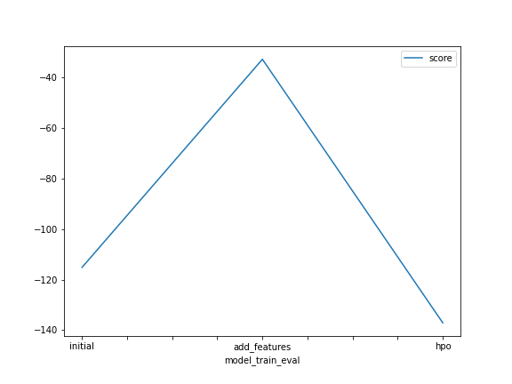
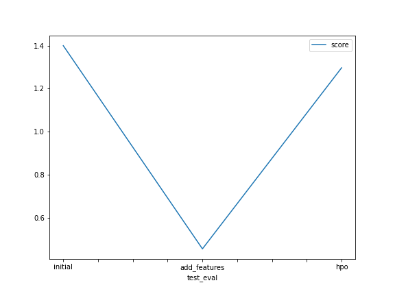

# Report: Predict Bike Sharing Demand with AutoGluon Solution
#### NAME HERE
Bashir Suleiman Muhammad

## Initial Training
### What did you realize when you tried to submit your predictions? What changes were needed to the output of the predictor to submit your results?
Kaggle doesn't accept the values which are less than 0. So, I converted the negative values to 0 and submitted the results.

### What was the top ranked model that performed?

Weighted Ensemble Model L3 was the most ranked model especially when I added new features, the performance improved substancially.

## Exploratory data analysis and feature creation
### What did the exploratory analysis find and how did you add additional features?

Exploratory analysis showed specifically the dtypes of all features, Season and Weather were changed to categorical type.
Features were also added by parsing datetime feature into year, month, day, hour, minute and seconds as new features

### How much better did your model preform after adding additional features and why do you think that is?

After adding additional features, the accuracy of the model is increased significantly. This is because the new features are strongly correlated to the target.

## Hyper parameter tuning
### How much better did your model preform after trying different hyper parameters?
After, trying out different parameters, I did notice that the performance of the model is changed. The model with the hyperperameters performs little less than one without hyperperameter configurations.

### If you were given more time with this dataset, where do you think you would spend more time?
The model performace increased greatly when nnew features are added as such, if given more time with this dataset,I would create more features, one of the ways is by changing some of the feature type to categorical and applying one hot encoding to give them binary values. And then when it gets to a point where I couldnt engineer new features, I would begin playing with the hyperparameters.

### Create a table with the models you ran, the hyperparameters modified, and the kaggle score.
|model|hpo1|hpo2|hpo3|score|
|--|--|--|--|--|
|initial|default|default|default|1.39998|
|add_features|default|Parsing of Dates and Feature Engineering|Parsing of Dates and Feature Engineeringt|0.45570|
|hpo|default|default|GBM, NN|1.29716|

### Create a line plot showing the top model score for the three (or more) training runs during the project.

TODO: Replace the image below with your own.

### Create a line plot showing the top kaggle score for the three (or more) prediction submissions during the project.

TODO: Replace the image below with your own.

## Summary
With this assignment I aimed solving a regression problem to predict the bike sharing demand, given the historical data. Framework used - AutoGluon The initial model was built with the default predictor and the model doesn't perform great. With Exploratory Data Analysis, assigned right data types for the features and with feature engineering, created new features based on the date time. With the new features, the performance of the model is drastically increased. Hyper parameter tuning is also done to improve the performance but that did not yield better results as of now. The final Submission is made to Kaggle and obtained a score of 1.31044 [RMSE] The model with new features is found to be performing better.
